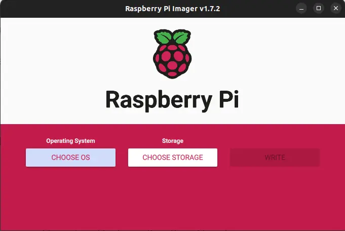
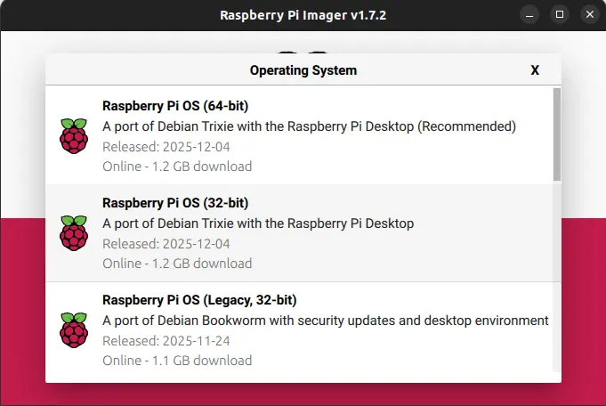
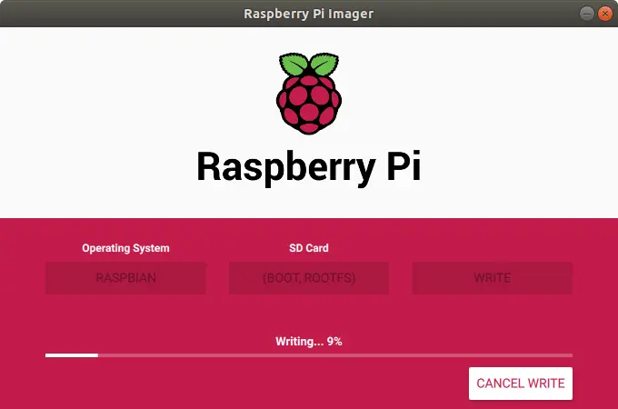

# Baking a Raspberry Pi 🍰🍓  
*By Senthilnathan PL — Robotics Interest Group, NIT Calicut ([RIGNITC](https://www.rignitc.com))*

---

## Table of Contents
- [Introduction](#introduction)
- [Ingredients Required](#ingredients-required)
- [Optional Items](#optional-items)
- [Baking the Raspberry Pi](#baking-the-raspberry-pi)
  - [Step 1 — Prepare the Hardware](#Step 1 — Prepare the Hardware)
  - [Understanding Hostname, Username, Wi-Fi & SSH](#understanding-hostname-username-wi-fi--ssh)
  - [Step 2 — Flash the Operating System](#Step 2 — Flash the Operating System)
    - > [Step 2.1 — Enabling USB Boot](#Step 2.1 — Enabling USB Boot) *Only for USB Drive Users*
  - [Step 3 — The First Boot (Headless Setup)](#Step 3 — The First Boot (Headless Setup))
- [Conclusion](#conclusion)
- [Hugo Front Matter](#hugo-front-matter-bonus)

---

## Introduction  
Hi there 👋!  

If you are new to the Raspberry Pi, Linux, or even basic networking — **don’t worry**.  
This guide is written for *absolute beginners* who want to set up their Raspberry Pi **without using any monitor, keyboard, or mouse**.

This method is called **headless setup** — your laptop will act as the screen for your Raspberry Pi.

By the end of this guide, you will know:
- how to install the Raspberry Pi OS,
- how to connect the Pi to your Wi-Fi,
- how to enter the Pi using “SSH” (don’t worry, we explain it),
- and how to start using your Pi like a tiny computer.

Let’s bake the Pi 🍰🔥

---

## Ingredients Required
You will need only a few items:

- **Raspberry Pi 3 / 4 / 5**  
  *(Optional: Case and cooling accessories)*

- **Storage Options**
  - SD Card + Card Reader  
  - OR USB Flash Drive  
  - **16 GB minimum**, **32 GB recommended**

- **Rated Power Adapter** for your Pi 
  This is important — a weak charger can prevent the Pi from booting.

---

## Optional Items
You don’t need these for a headless setup, but they help for troubleshooting:

- Monitor/TV with HDMI
- HDMI cable

> **Note:** These are only required if the OS fails to boot and troubleshooting is needed. **You can ignore these if everything goes well.**

---

# Baking the Raspberry Pi

## Step 1 — Prepare the Hardware
1. Place the Pi inside its **case** (for protection).  
2. Add **heatsinks or a fan** to keep it cool.  
3. Keep your SD card or USB pen drive ready.

That’s it for hardware!

---

## Understanding `hostname`, `username`, Wi-Fi & `ssh`
When installing the OS, Raspberry Pi Imager will ask you for a few details.  
If you are new to computers/Linux, these might sound confusing — so here's a simple explanation.

---

###  What is a Hostname?
Think of your Raspberry Pi like a person in a classroom.

A **hostname** is simply the *name* you give to your Raspberry Pi.  
It helps you find your Pi on your network.

Example hostnames:
- `rigpi`
- `robot-controller`
- `senthil-pi`

Later you will connect to your pi remotely using ssh:
```
hostname.local
```
Example:
```
rigpi.local
```

It’s just a **name tag** for your device.

---

###  What is a Username?
This is the account you will use to log into the Pi.

Raspberry Pi OS no longer has a default “pi” account.  
So you must create:

- **your own username**
- **your own password**

This is what you will type when connecting via SSH.

---

###  Why Set Up Wi-Fi?
Your Raspberry Pi does not know your Wi-Fi network.  
So you must tell it:

- the Wi-Fi name (SSID),
- the password.

This allows the Pi to automatically connect to your network the moment it turns on.

If you skip this → you cannot access the Pi headlessly.

---

###  Why Enable SSH?
SSH stands for **Secure Shell**.  
It lets you control your Raspberry Pi from your **laptop**, using text commands.

Think of it like opening a “remote window” into your Pi.

SSH is OFF by default for safety.  
So we enable it here to make the first connection easy.

---

## Step 2 — Flash the Operating System
This installs the Raspberry Pi OS onto your SD card or USB drive.

---

### 1. Plug storage into your computer  
Insert your SD card or USB stick using a card reader.

---

### 2. Install Raspberry Pi Imager  
Download from:  
https://www.raspberrypi.com/software/

Open the app.

> 

---

### 3. Select your Device and OS  
Choose:
- Your Pi model  
- The recommended Raspberry Pi OS
- Your Storage Device

> 

---

### 4. Edit Settings  
Click the **gear icon** (⚙️) to configure important details.

> 

Here you will enter:
- hostname  
- username  
- password  
- Wi-Fi details  
- enable SSH  

Take your time — these are needed for headless setup.

> 

---

### 5. Write the OS  
Click **Write**, wait a few minutes.

> 

Once it's done:

> 

Your SD card/USB is now ready!

---

## Step 2.1 — Enabling USB Boot  
*This step is ONLY for users who want their Raspberry Pi to boot from a **USB flash drive or SSD** instead of an SD card.*

Most modern Raspberry Pi models support USB boot by default, but **some older models require a manual change**.  
Let’s clear that up first.

---

###  Which Pi Models Need Manual USB Boot?

####  Models that ALREADY support USB boot (no changes needed)
These work out-of-the-box:
- **Raspberry Pi 4B**
- **Raspberry Pi 400**
- **Raspberry Pi 5**
- **Raspberry Pi 3B+**
- **Raspberry Pi 3A+**
- **Raspberry Pi Zero 2 W**

#### ⚠  Model that DOES need manual USB boot enabling
- **Raspberry Pi 3 Model B (non-Plus)**

If you are using **Pi 3B (not 3B+)**, you *must* follow this section.

---

##  What Are We Going to Do?

We will add **one line** to the Raspberry Pi’s configuration file to permanently enable USB boot:

```
program_usb_boot_mode=1
```

Once this setting is applied even once, the Raspberry Pi stores it in its **EEPROM**, meaning:
- It becomes permanent  
- You don’t need to repeat this on future OS installations  

---

##  IMPORTANT: The Config File Path Depends on Your Raspberry Pi OS Version

### 🟢 **For Raspberry Pi OS Bookworm (2023 and newer)**  
The boot system changed.  
The REAL config file is located at:

```
/boot/firmware/config.txt
```

### 🟡 **For Raspberry Pi OS Bullseye or older**  
Older systems used the classic layout:

```
/boot/config.txt
```

If you open `/boot/config.txt` on Bookworm, it will tell you:

> “DO NOT EDIT THIS FILE — The file you are looking for has moved to /boot/firmware/config.txt”

This is normal.

---

##  Steps to Enable USB Boot (Pi 3B only)

### 1. After flashing the OS, do NOT eject the SD card / USB drive yet.  
Your computer will show a drive named **boot** or **bootfs**.

### 2. Open the boot partition  
You will see files such as:
```
cmdline.txt
config.txt
overlays/
vmlinuz
```

### 3. Open the correct config.txt file

####  If using Bookworm  
Navigate to:
```
boot/firmware/config.txt
```

####  If using older Raspberry Pi OS  
Open:
```
boot/config.txt
```

### 4. Add this line at the **bottom** of the file:

```bash
program_usb_boot_mode=1
```

### 5. Save the file

### 6. Safely eject the storage drive  
Disconnect it from your computer.

---

##  USB Boot is Now Enabled!
When you power on your **Raspberry Pi 3B**, it will now:

- Look for **USB drives first**
- And boot from USB if a valid OS is installed there

This is ideal if you want:
- Faster speeds than an SD card  
- Better durability  
- A USB SSD–based robotics or server setup  

>  *You can remove the added line later if you wish — the Pi already stores the setting permanently.*

---


# Step 3 — The First Boot (Headless Setup)

### 1. Insert the SD card / USB  
Put it into the Raspberry Pi.

### 2. Power the Pi  
Connect the power adapter.  
A green LED will blink — this means it's working.

### 3. Wait 2–3 minutes  
The Pi configures itself and reboots automatically.

### 4. Connect from your laptop (SSH)

On your laptop, open:
- **Terminal** on Mac/Linux  
- **PowerShell** or “Command Prompt” on Windows  

Type:

```bash
ssh username@hostname.local
```

Example:
```bash
ssh senthil@rigpi.local
```

>⚠ **Note:**
>Your **Pi** and your **PC** should be on the **same network** to use *`ssh`* remote access


### 5. Approve the connection  

Type:
```
yes
```
Enter your password.


>Once your Terminal user details had changed into `<pi-username>@<pi-hostname>`,
>**You are now officially inside your Raspberry Pi !** 
>**Congratulations 🎉!** You have baked your first Raspberry Pi Successfully.


You are now **inside your Raspberry Pi**, without needing a monitor or keyboard 

---

## Conclusion
Your Raspberry Pi is now **baked, spiced, and ready to serve**! 🍽️  

You successfully:
- installed the OS  
- configured Wi-Fi and SSH  
- booted the Pi headlessly  
- and accessed it from your laptop  

This is the foundation of robotics, IoT, and Linux-based projects.

You’re officially a Raspberry Pi user now. 

---